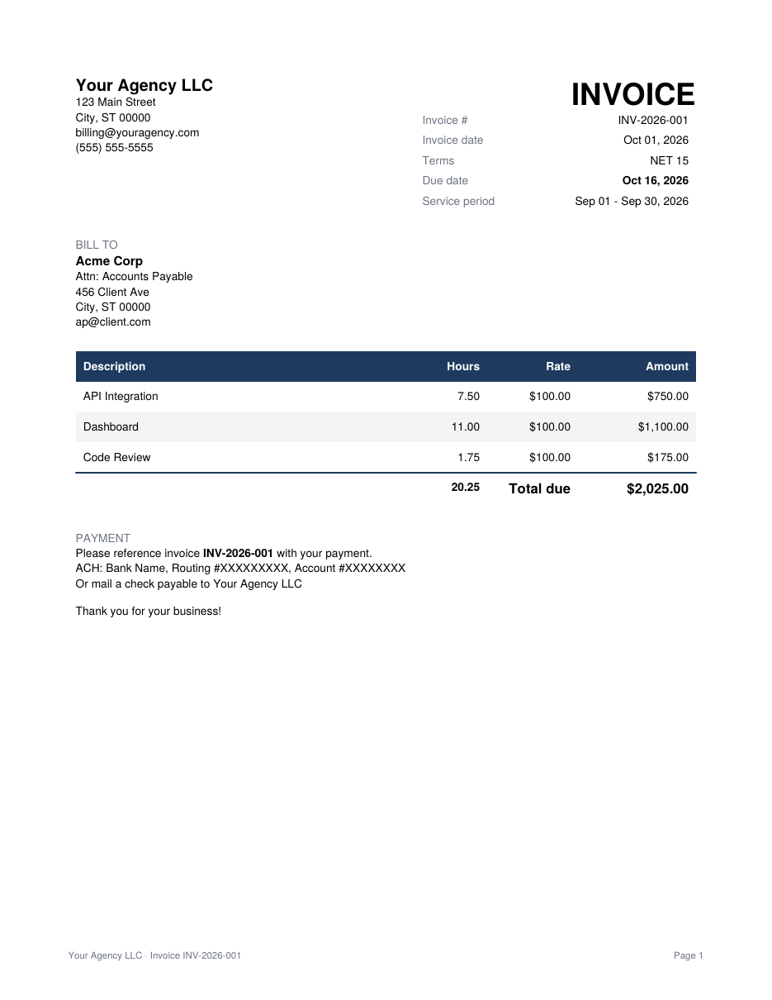

# timesheet2invoice

[](https://github.com/douglas-mason/timesheet2invoice/actions/workflows/ci.yml)
[](LICENSE)

Turn a CSV export from your time tracker (or its API) into a PDF invoice for hourly work. Built for freelancers and small consultancies that bill by the hour.

```console
$ timesheet2invoice generate toggl-september.csv
INV-2026-001  Acme Corp  2026-09-01 to 2026-09-30
      7.50 h  API Integration
     11.00 h  Dashboard
      1.75 h  Code Review
  --------
     20.25 h x $100.00 = $2,025.00
  Issued 2026-10-01, due 2026-10-16 (NET 15)
Wrote invoices/INV-2026-001_Acme_Corp_2026-09.pdf
```

<p align="center"></p>

## Features

- Reads exports from **Toggl Track, Clockify and Harvest**, or any CSV with a date column and an hours column
- Or skips the export and pulls hours straight from the Harvest, Toggl Track or Clockify API with a personal access token
- Skips entries marked non-billable and anything outside the billing month
- Groups line items by project, description or day, or lists each entry on its own line
- Rounds each line to the nearest 6, 15 or 30 minutes (or rounds up, or not at all)
- Sets the due date from your payment terms (NET 15, NET 30 and so on)
- Can add a page listing every time entry, which helps clients approve the invoice
- Numbers invoices in sequence and won't bill the same client for the same month twice
- Tracks payments in a plain CSV ledger, with a `status` command that shows what's overdue
- Uses decimal arithmetic for money, so there are no floating-point rounding errors

## Install

Requires Python 3.10+.

```bash
pipx install git+https://github.com/douglas-mason/timesheet2invoice
# or
pip install git+https://github.com/douglas-mason/timesheet2invoice
```

## Quick start

```bash
timesheet2invoice init                    # writes timesheet2invoice.toml
# edit it: your business, the client, rate, terms, payment instructions
timesheet2invoice generate export.csv -n  # preview the totals (dry run)
timesheet2invoice generate export.csv     # write the PDF and record it in the ledger
```

By default, `generate` bills the previous calendar month and dates the invoice today.

## Commands

| Command | What it does |
|---|---|
| `init [path]` | Write a commented starter config |
| `generate [csv]` (alias `gen`) | Create an invoice. Leave out the CSV to pull hours from the API set up under `[source]`. Options: `-m 2026-09` sets the month, `--issue-date 2026-10-01` sets the invoice date, `-n` does a dry run, `--force` allows a second invoice for the same month |
| `status` | List unpaid invoices with days until due or days overdue. `-a` includes paid invoices |
| `paid <invoice-no>` | Mark an invoice paid (today by default, or `--date YYYY-MM-DD`) |

Every command except `init` takes `-c path/to/config.toml`. The default is `./timesheet2invoice.toml`.

## Configuration

`timesheet2invoice init` writes a config file with comments explaining every option. The main settings are:

```toml
[billing]
hourly_rate = 100.00
net_days = 15              # due date = invoice date + 15 days
group_by = "project"       # project | description | day | entry
round_minutes = 15         # 0 = bill exact time
rounding = "nearest"       # nearest | up
tax_percent = 0

[invoice]
prefix = "INV"             # INV-2026-001, INV-2026-002, ...
start_number = 1           # set this if you're switching from another tool
include_time_log = true
```

Use one config file per client. Invoice numbers come from that config's ledger, so each client has its own sequence. To share one sequence across clients, point their configs at the same `ledger` path.

## Exporting your hours

| Tracker | Where to find the export |
|---|---|
| Toggl Track | Reports → Detailed → pick the month → Export → CSV |
| Clockify | Reports → Detailed → pick the month → Export → Save as CSV |
| Harvest | Reports → Time → Detailed Time Report → Export → CSV |
| Anything else | A CSV with `date` and `hours` columns, plus optional `project`, `description` and `billable` columns |

Durations can be decimal hours (`2.75`) or clock format (`2:45`, `02:45:00`). Dates can be ISO (`2026-09-02`) or US format (`09/02/2026`). For day-first dates, set `date_format = "%d/%m/%Y"` under `[billing]`.

If your tracker's export isn't recognized, [open an issue](https://github.com/douglas-mason/timesheet2invoice/issues/new?template=csv-format.md) and paste its header row.

## Pulling hours from the API

Instead of exporting a CSV every month, you can let `generate` download the month's entries itself. Add a `[source]` section to the config:

```toml
[source]
tracker = "harvest"        # harvest | toggl | clockify
account_id = "123456"      # Harvest only
client = "Acme Corp"       # optional: only bill this client's entries, as named in the tracker
```

Then put your token in an environment variable and run `generate` without a CSV:

```bash
export HARVEST_ACCESS_TOKEN=...   # or TOGGL_API_TOKEN / CLOCKIFY_API_KEY
timesheet2invoice generate -n
```

| Tracker | Where to get a token | Environment variable |
|---|---|---|
| Harvest | [id.getharvest.com/developers](https://id.getharvest.com/developers) → Create new personal access token. The page also shows your account ID. | `HARVEST_ACCESS_TOKEN` (and optionally `HARVEST_ACCOUNT_ID`) |
| Toggl Track | Profile settings → API Token | `TOGGL_API_TOKEN` |
| Clockify | Preferences → Advanced → Manage API keys | `CLOCKIFY_API_KEY` |

Other `[source]` options:

- `token_env` reads the token from a differently named variable, which helps if you bill from more than one account.
- `token` holds the token in the config file itself. The default `.gitignore` keeps `timesheet2invoice.toml` out of git, but an environment variable is safer.
- `workspace_id` picks a Toggl or Clockify workspace. The default is your current one.
- `billable_only = false` bills every entry. Toggl's free plan has no billable flag, so free-plan users need this.

Running timers are skipped. Toggl and Clockify return only your own entries; Harvest returns everyone's that your token can see, so use `client` (or a token for a single user) to narrow it down. Toggl's API may not return entries from far back; if an older month comes back empty, use a CSV export for it.

## A monthly routine

1. On the 1st, finish logging last month's time and check that billable entries are marked.
2. Export the detailed CSV and run `timesheet2invoice gen export.csv -n` to check the hours.
3. Run it again without `-n` and email the PDF to the client.
4. Check `timesheet2invoice status` every week or so. When a payment arrives, run `timesheet2invoice paid INV-2026-001`.

## Privacy

Everything runs locally. The tool makes no network requests unless you add a `[source]` section, and then it only contacts that tracker's API. The `.gitignore` excludes `timesheet2invoice.toml`, `invoices/` and CSV files, so client and bank details won't end up in a commit by accident.

## Development

```bash
git clone https://github.com/douglas-mason/timesheet2invoice
cd timesheet2invoice
python -m venv .venv && source .venv/bin/activate
pip install -e ".[dev]"
pytest
ruff check . && ruff format --check .
```

See [CONTRIBUTING.md](CONTRIBUTING.md).

## License

[MIT](LICENSE)
